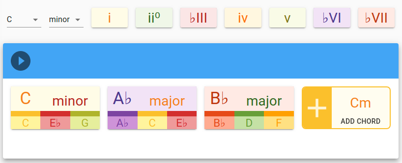
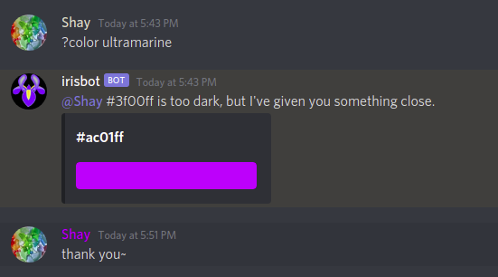

# Chordly

**<a href="https://chordly.xyz" target="_blank">Chordly</a>** is an interactive
musical & visual experience that allows anyone explore musical ideas and
compose chord progressions. Play is a vital part of creativity, and Chordly is
designed first and foremost to encourage playful engagement, letting you
discover what sounds good by trying it out.

# Irisbot

**<a href="https://github.com/specifictionally/irisbot" target="_blank">Irisbot</a>**
is a Discord chatbot that lets users self-service a variety of minor requests
that would otherwise have to be done by a moderator -- within predefined bounds.
It can let users join and leave certain channels on their own, or change their
name's display color.

